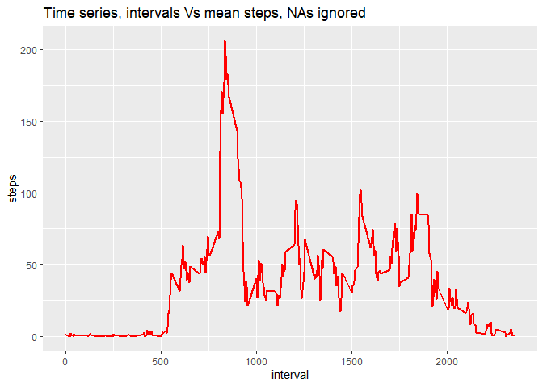
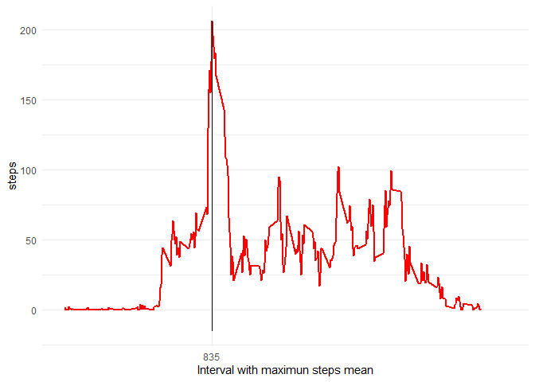
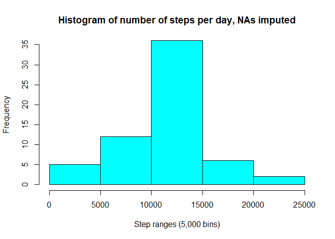
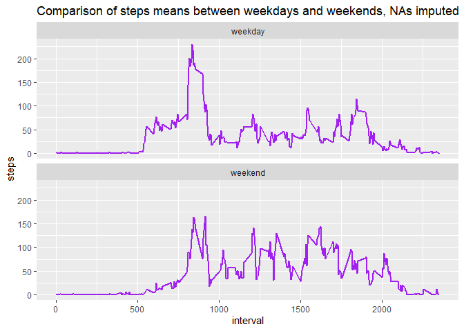

# "Coursera "Reproducible Research", week 2, project 1"  
author: "OPaz"  
date: "7/4/2020"  
output: html_document  

## R Markdown Project (Coursera)

This is an R Markdown document produced to fulfill project 1 of the Coursera's "Reproducible Research" project corresponding to week 2. I will be listing the requiered activities and its proposed answers. I will be working with a data set that comprises data collected from activity movement monitoring devices, particularly three variables:  

steps: Number of steps taking in a 5-minute interval (missing values are coded as NA).  
date: The date on which the measurement was taken in YYYY-MM-DD format.  
interval: Identifier for the 5-minute interval in which measurement was taken.  


### First Step: Collecting and manipulating data & plotting total steps.  

- Loading and transforming data:  


```r
activity <- read.csv("activity.csv")
activity$date <- as.Date(as.character(activity$date))
head(activity,15)
```

```
##    steps       date interval
## 1     NA 2012-10-01        0
## 2     NA 2012-10-01        5
## 3     NA 2012-10-01       10
## 4     NA 2012-10-01       15
## 5     NA 2012-10-01       20
## 6     NA 2012-10-01       25
## 7     NA 2012-10-01       30
## 8     NA 2012-10-01       35
## 9     NA 2012-10-01       40
## 10    NA 2012-10-01       45
## 11    NA 2012-10-01       50
## 12    NA 2012-10-01       55
## 13    NA 2012-10-01      100
## 14    NA 2012-10-01      105
## 15    NA 2012-10-01      110
```
- Plotting a histogram for total steps, NAs are not considered in this part:  

```r
act <- activity %>% group_by(date)%>% summarise(steps=sum(steps))
hist(act$steps, 
     main="Histogram of number of steps per day, NAs ignored",
     xlab = "Step ranges (5,000 bins)", col = 5, ylim = c(0,30))
```

```
## Error in hist.default(act$steps, main = "Histogram of number of steps per day, NAs ignored", : invalid number of 'breaks'
```

As you can see from the plot, the bulk of steps seem to fall between 10,000 - 15,000, As pero instructed, NAs were ignored in this study.  

- Calculating the mean and median of the total number of steps taken per day:


```r
mean(act$steps, na.rm = T)
```

```
## [1] NaN
```

```r
median(act$steps, na.rm = T)
```

```
## [1] NA
```
 
 **It is noticeable that the mean and means are quite close, which is consistent with the "normal" distribution shown in the plot above. Again NAS ignored here.**   

## Step 2: Making a time series plot  of the 5-minute interval (x-axis) and the average number of steps taken, averaged across all days (y-axis):  


```r
series_plot <- aggregate(steps ~ interval, activity, mean)

g <- ggplot(series_plot,aes(interval, steps))+
      geom_line(size=1, color= "red")
g + ggtitle("Time series, intervals Vs mean steps, NAs ignored")
```




### Step 2.2 Determining the 5-minute interval which, on average across all the days in the dataset, contains the maximum number of steps:


```r
Max <- max(series_plot$steps)
series_plot[series_plot$steps==Max,1]
```

```
## [1] 835
```

```r
g + geom_segment(aes(x=835,y=-15,xend=835,yend=Max))+
      scale_x_continuous(limits = c(0, 2500), breaks = 835,
            name = "Interval with maximun steps mean")+
    theme_minimal()
```



**The interval was calculated to be 835, which yields a little above 200 steps, on average. It follows that, interval 835 was the main steps contributor among all 61 days in the study.**

## Step 3: Imputting missing values:  

- I'll start by determining the NAs per column:

```r
colSums(is.na(activity))
```

```
##    steps     date interval 
##     2304        0        0
```

- Now I'll calculate the means per day to be imputted into final DF:

```r
actNotNa <- activity[!is.na(activity$steps),]
act4 <- actNotNa %>% group_by(interval) %>% summarize(Mean=mean(steps, na.rm = T))
```

- The next code will serve for data handling to impute mean values instead of NAs per day (split+merge+arrange):


```r
actNA <- activity[is.na(activity$steps),]

mrg <- merge(actNA,act4, by.y="interval")
```

```
## Error in fix.by(by.y, y): 'by' must specify a uniquely valid column
```

```r
mrg$steps <-mrg$Mean
mrg <- mrg[-4]
mrg <- mrg[c(2,3,1)]
```

```
## Error in `[.data.frame`(mrg, c(2, 3, 1)): undefined columns selected
```

```r
act_imp <- rbind(actNotNa,mrg)
```

```
## Error in rbind(deparse.level, ...): numbers of columns of arguments do not match
```

```r
act_imp <- arrange(act_imp,date)
```

Now our imputed data frame is "act_imp", first rows follow:

```r
head(act_imp,15)
```

```
##        steps       date interval day_type
## 1  1.7169811 2012-10-01        0  weekday
## 2  0.3396226 2012-10-01        5  weekday
## 3  0.1320755 2012-10-01       10  weekday
## 4  0.1509434 2012-10-01       15  weekday
## 5  0.0754717 2012-10-01       20  weekday
## 6  2.0943396 2012-10-01       25  weekday
## 7  0.5283019 2012-10-01       30  weekday
## 8  0.8679245 2012-10-01       35  weekday
## 9  0.0000000 2012-10-01       40  weekday
## 10 1.4716981 2012-10-01       45  weekday
## 11 0.3018868 2012-10-01       50  weekday
## 12 0.1320755 2012-10-01       55  weekday
## 13 0.3207547 2012-10-01      100  weekday
## 14 0.6792453 2012-10-01      105  weekday
## 15 0.1509434 2012-10-01      110  weekday
```

### Step 3.2 Mean and median number of steps taken each day (NAs now imputed):


```r
act5 <- act_imp %>% group_by(date)%>% summarise(steps=sum(steps))
mean(act5$steps)
```

```
## [1] 656737.5
```

```r
median(act5$steps)
```

```
## [1] 656737.5
```

**As expected, they are equal now, after imputing the means in all data**

### Step 3.3 Plotting again with NAs now imputed into activity:


```r
act2 <- act_imp %>% group_by(date)%>% summarise(steps=sum(steps))
hist(act2$steps, 
     main="Histogram of number of steps per day, NAs imputed",
     xlab = "Step ranges (5,000 bins)", col = 5, ylim = c(0,35))
```



**The graph now shows more volume but same shape, as expected, now with more data**

## Step 4: Create a new factor variable in the dataset with two levels – “weekday” and “weekend” indicating whether a given date is a weekday or weekend day.  

The following code will accomplish the task, using a loop, if-else operation, and basic R data manipulation:

```r
act_imp$date <- as.Date(act_imp$date)

i <- as.numeric()
for (i in 1:nrow(act_imp)){
  if (weekdays(act_imp$date[i])== "Saturday")
  {act_imp$day_type[i]<- "weekend"} else 
    if (weekdays(act_imp$date[i])== "Sunday"){
      act_imp$day_type[i]<- "weekend"
    }
  else{
    act_imp$day_type[i]<-"weekday" 
  }
}
```

A sample of our new "act_imp" follows, as well as a table of weekdays and weekends:

```r
head(act_imp,15)
```

```
##        steps       date interval day_type
## 1  1.7169811 2012-10-01        0  weekday
## 2  0.3396226 2012-10-01        5  weekday
## 3  0.1320755 2012-10-01       10  weekday
## 4  0.1509434 2012-10-01       15  weekday
## 5  0.0754717 2012-10-01       20  weekday
## 6  2.0943396 2012-10-01       25  weekday
## 7  0.5283019 2012-10-01       30  weekday
## 8  0.8679245 2012-10-01       35  weekday
## 9  0.0000000 2012-10-01       40  weekday
## 10 1.4716981 2012-10-01       45  weekday
## 11 0.3018868 2012-10-01       50  weekday
## 12 0.1320755 2012-10-01       55  weekday
## 13 0.3207547 2012-10-01      100  weekday
## 14 0.6792453 2012-10-01      105  weekday
## 15 0.1509434 2012-10-01      110  weekday
```

```r
table(act_imp$day_type)
```

```
## 
## weekday weekend 
##   12960    4608
```

### Step 2.2 Make a panel plot containing a time series plot of the 5-minute interval (x-axis) and the average number of steps taken, averaged across all weekday days or weekend days (y-axis).

The following code, using ggplot2, will show the desired graphs:


```r
activity7 <- act_imp %>%
              group_by(day_type,interval) %>%
             summarize(steps=mean(steps))

ggplot(activity7,aes(interval, steps))+
  geom_line(size=1, color= "purple")+
  facet_wrap(~day_type, nrow=2)+
  ggtitle("Comparison of steps means between weekdays and weekends, NAs imputed")
```

```
## Error: At least one layer must contain all faceting variables: `day_type`.
## * Plot is missing `day_type`
## * Layer 1 is missing `day_type`
```



**Looks like, in general, our participants started to walk later on weekends and more evenly, compared to weekdays. But that what weekends are for, right? ;)**
